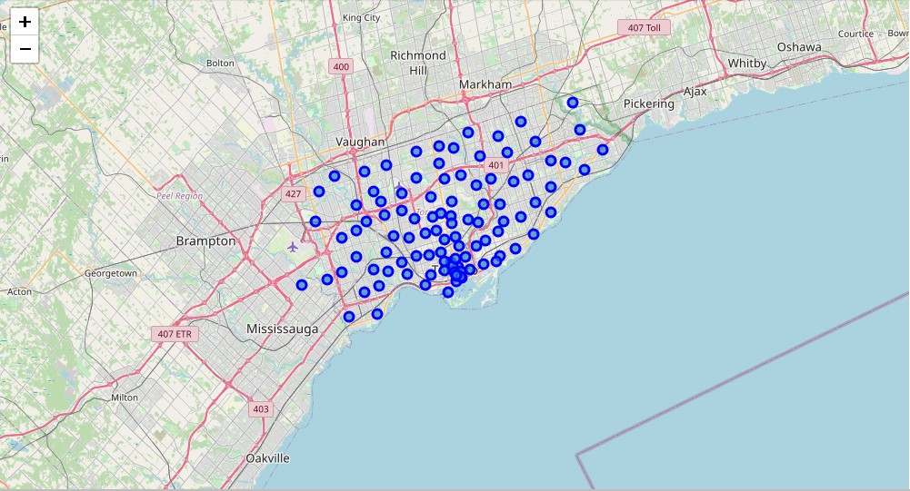
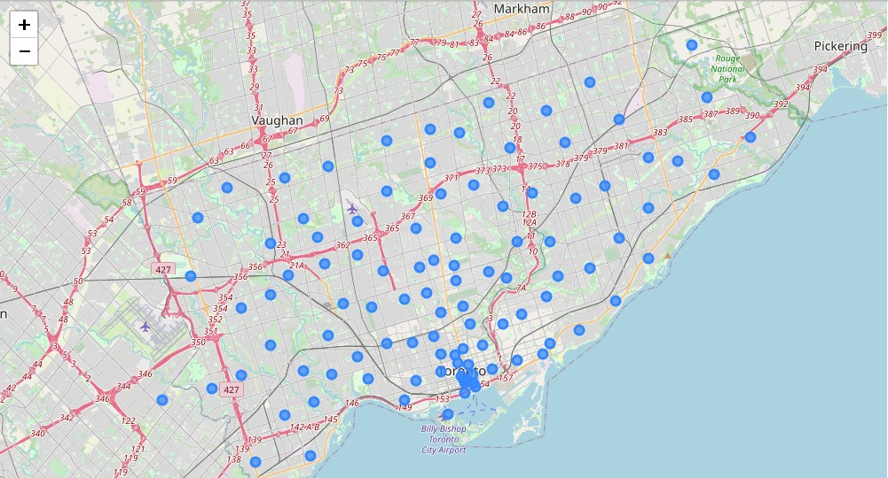

# Segmenting-and-clustering-neighborhoods-in-Toronto

In this project we segment and cluster neighborhoods in Toronto

Here are the images as outputs of the notebook:

First, the different venues:

Then the clustering results:

